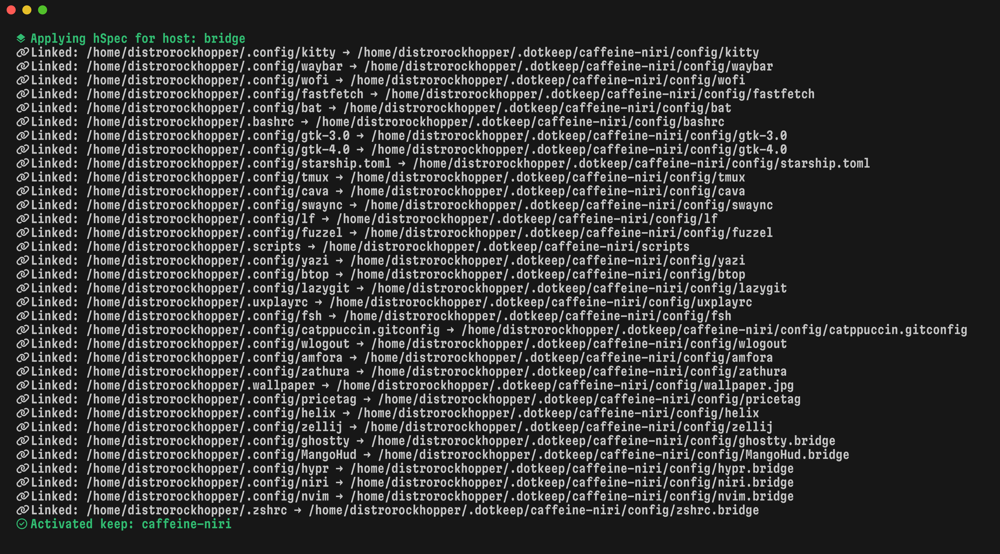

# dotkeeper

> [!WARNING]
> This is the experimental **go** rewrite of dotkeeper.
> Some functionality may not be implemented



A *keeper* for your *dotfiles*. See what I did there? *(booooooo)*

To get started, create a folder in `~/.dotkeep` with the name of your **keep**. A **keep** is a place where dots are kept.

## Info

To learn how to use Dotkeeper, see the [wiki](https://github.com/StikyPiston/dotkeeper/wiki)

## Installation

### Method 1: Homebrew

To install with `brew`, simply run:

```bash
brew install stikypiston/formulae/dotkeeper
```

### Method 2: Manual Install


#### Dependencies:

- Swift (can be installed with `brew install swift`, or with `swiftly`)

#### Instructions

To install manually, first clone the repository.

```bash
git clone https://github.com/StikyPiston/dotkeeper
```

Then, `cd` into the directory.

```bash
cd dotkeeper
```

Use `swift` to build the project.

```bash
swift build --configuration release
```

And finally, move the executable into a location like `/usr/local/bin/`

```bash
sudo mv .build/release/dotkeeper /usr/local/bin/
```
